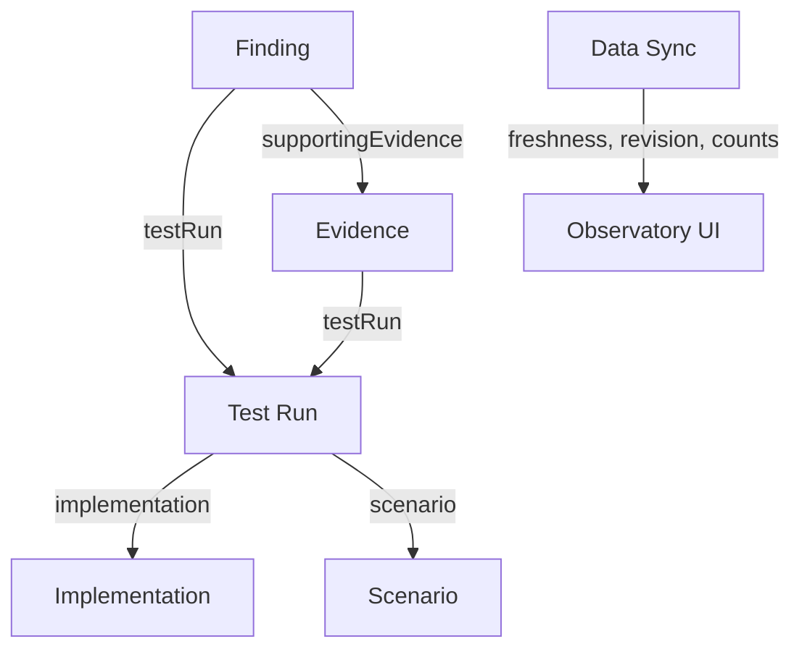

# MCP Failure Observatory

[](https://observatory.mcplab.dev)
[](LICENSE)

MCP Failure Observatory is a public, evidence-backed view of how Model Context Protocol implementations behave under recorded failure and recovery scenarios.

It turns the reports produced by [MCP Failure Lab](https://github.com/anilloutombam/mcp-failure-lab) into structured compatibility data in Sanity: implementations, scenarios, Test Runs, Evidence, reviewed Findings, version history, and transport-level comparisons.

> The Observatory is an evidence index, not a certification program or a complete measure of implementation quality.

## Links

| Resource                      | URL                                                                                          |
| ----------------------------- | -------------------------------------------------------------------------------------------- |
| Live Observatory              | [observatory.mcplab.dev](https://observatory.mcplab.dev)                                     |
| Methodology and limitations   | [observatory.mcplab.dev/methodology](https://observatory.mcplab.dev/methodology)             |
| Observatory source            | [github.com/anilloutombam/mcp-observatory](https://github.com/anilloutombam/mcp-observatory) |
| MCP Failure Lab               | [github.com/anilloutombam/mcp-failure-lab](https://github.com/anilloutombam/mcp-failure-lab) |
| MCP Failure Lab documentation | [mcplab.dev](https://mcplab.dev)                                                             |

## What you can explore

- A compatibility overview across implementations and scenarios
- Filterable Test Runs with versions, transports, statuses, dates, and context
- Test Run details with observations, Evidence, source reports, and Findings
- Findings linked to upstream issues or evidence comments
- Implementation pages with version and compatibility history
- Side-by-side comparisons across versions, scenarios, and transports
- Shareable filter, comparison, and pagination URLs
- Published methodology, status meanings, sources, and limitations
- Live data freshness and source-revision information

## Architecture

```mermaid
flowchart LR
    implementation["MCP implementation"] --> runner["Failure Lab scenario runner"]
    runner --> results["JSON test results"]
    results --> report["Public compatibility report"]
    results --> manifest["Versioned manifest"]
    manifest --> publish["Failure Lab publish workflow"]
    publish -->|repository dispatch| sync["Observatory sync workflow"]
    sync --> validate["Validate complete manifest"]
    validate --> importer["Idempotent importer"]
    importer --> sanity["Sanity Content Lake"]
    sanity -->|GROQ| next["Next.js application"]
    next --> visitor["Public Observatory"]

    report -. source evidence .-> next
```



The responsibilities stay separate:

- **MCP Failure Lab** executes the tests and owns the source reports.
- **The versioned manifest** carries normalized, reviewable facts between repositories.
- **The Observatory importer** validates and upserts records using stable source keys.
- **Sanity** stores related content while retaining editorial control over Findings.
- **The Next.js application** queries and presents the published dataset.

## Sanity content model



| Document       | Purpose                                                                            |
| -------------- | ---------------------------------------------------------------------------------- |
| Implementation | An MCP client, SDK, server, proxy, or gateway and its repository identity          |
| Scenario       | A named compatibility, failure, timing, transport, protocol, or lifecycle behavior |
| Test Run       | One recorded implementation version, scenario, transport, date, and outcome        |
| Evidence       | The observation and source material supporting a Test Run                          |
| Finding        | A human-reviewed conclusion with upstream reporting state                          |
| Data Sync      | The source revision, completion time, status, and imported record counts           |

Sanity generates document IDs. Stable external identities are stored in `sourceKey` fields and used for idempotent imports; relationships use Sanity references returned from document lookups or creation.

## Data flow and safety

1. Failure Lab runs compatibility scenarios and publishes a public report.
2. A normalized manifest is validated and committed alongside the report.
3. The Failure Lab workflow dispatches the manifest URL and source revision.
4. The Observatory validates the complete manifest before the first Sanity write.
5. Implementations, scenarios, Test Runs, and Evidence are created or updated by stable source identity.
6. New Findings enter `Needs review`. Existing Findings are preserved so automation cannot overwrite human review, resolution, or upstream-reporting decisions.
7. A Data Sync record exposes freshness, revision, and imported counts to the application.

Repeated or interrupted imports are safe to rerun. Existing source records are updated instead of duplicated, and invalid manifests are rejected before writes begin.

## Status meanings

Test Run statuses describe one recorded version, transport, environment, and scenario.

| Status         | Meaning                                                                  |
| -------------- | ------------------------------------------------------------------------ |
| Passed         | The observed behavior matched the configured expectation                 |
| Failed         | The observed behavior did not match the expectation                      |
| Needs review   | The result was recorded but still needs human interpretation             |
| Unsupported    | The implementation or transport does not support the required capability |
| Not run        | No completed result was produced                                         |
| Not applicable | The scenario does not apply to this implementation or transport          |

A missing matrix result means there is no recorded result. It does not mean the implementation failed.

Finding reporting states distinguish issues opened by MCP Failure Lab, evidence added to existing issues, unreported Findings, resolved upstream issues, and behavior that is not actionable upstream.

## Technology

- Next.js App Router, React, and TypeScript
- Sanity Content Lake, Studio, and GROQ
- GitHub Actions for cross-repository publishing and synchronization
- Vercel for production hosting
- Sentry for privacy-conscious production error monitoring

The embedded Sanity Studio is available at `/studio` for authorized editors.

## Local development

### Requirements

- Node.js 22
- npm
- A Sanity project and dataset

Install dependencies and create a local environment file:

```bash
npm install
cp .env.example .env.local
```

Set the public values used by the application:

```dotenv
NEXT_PUBLIC_SANITY_PROJECT_ID="your-project-id"
NEXT_PUBLIC_SANITY_DATASET="production"
```

Start the development server:

```bash
npm run dev
```

Open [http://localhost:3000](http://localhost:3000).

### Validation commands

```bash
npm run format:check
npm run lint
npm test
npm run build
```

## Importing Failure Lab data

Sanity writes require a server-only token:

```dotenv
SANITY_API_WRITE_TOKEN="your-write-token"
```

Validate a manifest without writing:

```bash
npm run sync:failure-lab
```

Write a validated manifest to Sanity:

```bash
npm run sync:failure-lab -- --write
```

Use a specific local or HTTPS manifest and revision:

```bash
npm run sync:failure-lab -- \
  --source=<path-or-https-url> \
  --revision=<commit-or-release>
```

Use a write token with only the permissions required for the target dataset. Never commit `.env.local` or a Sanity token.

## Automated synchronization

The `Sync MCP Failure Lab data` workflow supports:

- `repository_dispatch` after Failure Lab publishes data
- manual `workflow_dispatch` with optional source and revision inputs
- a daily fallback when `MCP_FAILURE_LAB_SYNC_URL` is configured

Configure the following repository values:

| Type     | Name                       | Purpose                                    |
| -------- | -------------------------- | ------------------------------------------ |
| Variable | `SANITY_PROJECT_ID`        | Target Sanity project                      |
| Variable | `SANITY_DATASET`           | Target dataset                             |
| Variable | `MCP_FAILURE_LAB_SYNC_URL` | Published manifest used by scheduled syncs |
| Secret   | `SANITY_API_WRITE_TOKEN`   | Minimum-permission dataset write token     |

## Limitations

- Results apply only to the recorded implementation version, environment, transport, and scenario.
- New releases may behave differently from the version shown.
- Timing results are evidence from a test environment, not general performance benchmarks.
- The dataset is selective and does not cover every MCP feature, implementation, or deployment environment.
- A verified Finding means its evidence was reviewed; it does not imply upstream maintainer agreement.
- The Observatory does not execute tests or accept arbitrary repository code.

Read the full [methodology and limitations](https://observatory.mcplab.dev/methodology) before drawing broad conclusions from the data.

## Deployment

The public application is deployed on Vercel at [observatory.mcplab.dev](https://observatory.mcplab.dev).

Production requires the public Sanity environment values listed above. The production origin must also be registered with Sanity for Studio access.

## Roadmap

- Coverage-gap views for untested scenario and transport combinations
- Sync diagnostics and import history
- Upstream Finding lifecycle and resolution tracking
- Dataset changelog and release summaries

## Contributing

Issues and focused pull requests are welcome. Compatibility-data changes must include the public Failure Lab report or upstream evidence supporting the change. Test execution and raw claims belong in MCP Failure Lab; structured presentation and import behavior belong in this repository.

## License

Licensed under the [MIT License](LICENSE).
